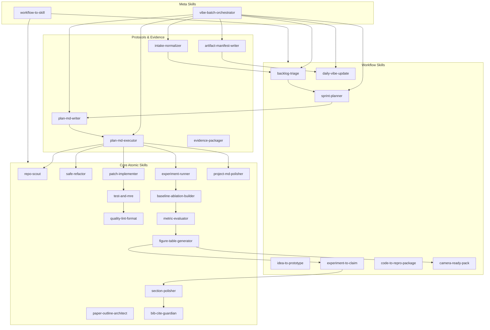
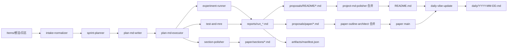

可以，而且**一份“元方法”完全适合做成“元 Skill”**：你每次只要把“我手工怎么做”口述/粘贴进去，它就自动产出 SOP + 分支树 + 质量门禁 + 可落地的 `SKILL.md` 草案。

下面给你两套可直接落地的 Skill（**Codex** / **Claude Code**）。两边都用 `SKILL.md`（YAML 头 + Markdown 指令），并放在各自的技能目录里：Codex 支持 `~/.codex/skills` 或仓库内 `.codex/skills` ([OpenAI Developers][1])；Claude Code 支持 `~/.claude/skills/` 或仓库内 `.claude/skills/` ([Claude Code][2])

---

## 1) Codex 版 Skill：`workflow-to-skill`

### 放置位置（任选其一）

* 个人全局：`~/.codex/skills/workflow-to-skill/SKILL.md` ([OpenAI Developers][1])
* 仓库共享：`<repo>/.codex/skills/workflow-to-skill/SKILL.md` ([OpenAI Developers][1])

> 注意：Codex 会忽略**符号链接的技能目录**，所以不要用 symlink 偷懒共享 ([OpenAI Developers][3])

### `SKILL.md`（直接复制）

```markdown
---
name: workflow-to-skill
description: 将你的手工SOP/工作流抽取为可复用的Agent Skill规格与SKILL.md草案。适用于“我平时怎么一步步做X”“把这个流程封装成skill”“从手工步骤生成SOP/分支/质量门禁/技能文件”等请求。When the user describes a manual workflow and wants to save time by turning it into a reusable skill.
metadata:
  short-description: Workflow → SOP → Skill Spec → SKILL.md
---

# Workflow → Skill 抽取器（元 Skill）

## 目标
把用户“不开 Skill 时的真实操作步骤”结构化成：
1) 流程地图（SOP）表格：Step | 目的 | 可执行操作 | 前置/依赖 | 产物 | 完成判定 | 风险/回滚  
2) 决策分支树：如果…则…，并要求每个分支给出最小证据（看什么信号/日志/文件）  
3) 质量门禁（Quality Gates）：必须通过的检查点 + 失败处理策略  
4) Skill 规格：触发条件、上下文、执行步骤粒度、产物清单、默认参数、禁止项、需要人工确认项  
5) MVP 版本：只保留最省时的 20% 步骤，并给出 v0.1→v0.2→v1.0 迭代路线  
6) （可选）生成可直接落地的 `SKILL.md` 草案（给出目录结构建议）

## 工作方式
### A. 先采集信息（不要一次问用户很多问题；用“可直接填空”的模板引导）
按以下顺序采集，缺项就用“合理假设”，并在输出里显式写出“假设”：
- 任务名称/类型（代码开发 / 报错修复 / 论文润色 / 审稿回复 / 实验复现…）
- 成功标准（做到什么算完成）
- 输入是什么（issue/报错/段落/审稿意见/日志/数据…）+ 一小段示例
- 输出落点（哪些文件/目录/产物必须生成）
- 用户当前的手工步骤（乱也没关系，逐条列）
- 用户经验规则（如何判断根因、如何选A/B、如何验收、如何写总结/commit/回复）

【采集模板】（直接发给用户，让他粘贴填写）
- 任务名称：
- 触发场景：
- 成功标准：
- 输入来源与示例：
- 相关目录/文件路径：
- 手工步骤（Step 0..N）：
- 判断依据/经验规则：
- 验收方式（测试/编译/latex编译/复现/一致性检查等）：
- 禁止自动做的事（例如强推主分支、删除文件等）：

### B. 抽取与归纳（把口水话变成可执行步骤）
- 把每一步改写成“动词开头、可执行、可验证”的操作描述
- 对每步补全：前置条件 / 输入输出 / 完成判定 / 风险回滚
- 从用户的经验规则中抽取“决策分支”与“门禁条件”
- 标注：哪些步骤适合脚本化/模板化/并行化/缓存化

### C. 输出要求（强制）
输出必须包含以下标题，并尽量用 Markdown 表格/清单：
1) 假设与范围  
2) 流程地图（SOP 表格）  
3) 决策分支（如果…则… + 最小证据）  
4) 质量门禁（Quality Gates）  
5) Skill 规格（可落地）  
6) MVP（今天就能用）+ 迭代路线  
7) （可选）`SKILL.md` 草案 + 推荐目录结构（含 scripts/ references/ assets/ 何时用）

## 安全策略
- 默认只产出文本规范与文件草案，不在用户未明确要求时修改/删除任何文件
- 涉及执行命令、改动代码、写入文件时：先给出“将要做什么 + 风险”，再等待用户明确指令
- 对“不可逆操作”（强推、删除、覆盖大段文件、改主分支）一律要求人工确认
```

---

## 2) Claude Code 版 Skill：`workflow-to-skill`

### 放置位置（任选其一）

* 个人全局：`~/.claude/skills/workflow-to-skill/SKILL.md` ([Claude Code][2])
* 仓库共享：`<repo>/.claude/skills/workflow-to-skill/SKILL.md` ([Claude Code][2])

（Claude Code 的 Skill 也是 `SKILL.md` + YAML 头，且会根据 `description` 做自动触发 ([Claude Code][2])）

### `SKILL.md`（直接复制）

```markdown
---
name: workflow-to-skill
description: 把用户的“手工做事流程/SOP”抽取成可复用的Agent Skill规格与SKILL.md草案。用于：封装代码开发/论文撰写修改/润色/审稿回复等流程；当用户说“把我的步骤变成skill/元prompt做成skill/我平时怎么一步步做X”时自动触发。
allowed-tools: Read, Grep, Glob
---

# Workflow → Skill 抽取器（元 Skill）

## 你要做什么
当用户描述一个“不开 Skill 时”的手工流程（可能很乱），你负责把它提炼为：
- SOP 流程地图（表格）
- 决策分支树（如果…则… + 最小证据）
- 质量门禁（必须通过的检查点 + 失败处理）
- Skill 规格（触发条件/上下文/步骤粒度/产物/参数/安全策略）
- MVP（先落地最省时版本）+ 迭代路线
- 可直接落地的 `SKILL.md` 草案（可选）

## 交互策略
- 不要一次抛很多问题；先给“可填空模板”，让用户把手工步骤粘贴进来
- 缺信息就做“合理假设”，并在输出开头列出假设
- 如果用户想让你“真的生成技能文件并写入仓库”，你需要提醒：你当前仅有读权限（Read/Grep/Glob），请用户明确授权写入或手动复制你给的文件内容

## 采集模板（发给用户填写）
- 任务名称：
- 触发场景：
- 成功标准：
- 输入来源与示例：
- 相关目录/文件路径：
- 手工步骤（Step 0..N）：
- 判断依据/经验规则：
- 验收方式（测试/编译/latex编译/复现/一致性检查等）：
- 禁止自动做的事：

## 输出格式（强制）
### 1) 假设与范围
### 2) 流程地图（SOP）
用表格：Step | 目的 | 操作（可执行） | 依赖/前置 | 产物 | 完成判定 | 风险/回滚
### 3) 决策分支
“如果…则…”，每条给最小证据（看什么日志/文件/信号）
### 4) 质量门禁（Quality Gates）
列出门禁 + 失败处理 + 是否允许继续
### 5) Skill 规格（可落地）
- Skill 名称候选（2-4 个）
- 适用/不适用范围
- 触发条件（用户意图 + 关键词 + 必要上下文）
- 需要读取/修改的文件模式（如适用）
- 执行步骤（可工具调用的粒度）
- 产物清单（文件名/路径/格式）
- 默认参数与可覆盖参数
- 安全策略（禁止项 + 需人工确认项）
### 6) MVP + 迭代路线
v0.1→v0.2→v1.0
### 7) （可选）SKILL.md 草案
给出目录结构建议：SKILL.md / references/ / assets/ / scripts/
```

---

## 3)（可选但很爽）再给 Claude Code 做一个显式触发的 `/skillify` 命令

因为 Claude Code 的 **slash command** 可以把“采集模板”一键发出来，省你打字；命令文件放 `.claude/commands/` ([Claude Code][4])

`.claude/commands/skillify.md`：

```markdown
请把我下面粘贴的“手工流程”抽取成：SOP表格、决策分支、质量门禁、Skill规格、MVP、以及可落地的SKILL.md草案（可选）。

【采集模板】
- 任务名称：
- 触发场景：
- 成功标准：
- 输入来源与示例：
- 相关目录/文件路径：
- 手工步骤（Step 0..N）：
- 判断依据/经验规则：
- 验收方式：
- 禁止自动做的事：
```

---

## 你下一步怎么用（最省事）

1. 先把上面的 Skill 放进对应目录（Codex/Claude 任意一个先用即可）
2. 然后你只需要对它说一句：

   * “我不用 skill 时做 XXX 的手工步骤如下：……（Step0..N）”
3. 它就会按 Skill 产出一份“可落地封装稿”。

如果你愿意，我也可以直接按你最常见的一个场景（比如“修复报错+提交”或“审稿意见→逐条回复→改文→编译”），帮你把**第一份**流程当场抽取成 SOP + 技能文件草案；你只要把你现在真实的步骤（乱序也行）贴出来即可。

[1]: https://developers.openai.com/codex/skills/ "Agent Skills"
[2]: https://code.claude.com/docs/en/skills "Agent Skills - Claude Code Docs"
[3]: https://developers.openai.com/codex/skills/create-skill/ "Custom skills"
[4]: https://code.claude.com/docs/en/slash-commands "Slash commands - Claude Code Docs"


可以，而且这是**最推荐的做法**：用一个 Git 仓库当作 “Skill Monorepo”，用版本号/Tag 管理迭代；再用脚本把它**发布/同步**到 `~/.claude/skills/`、`~/.codex/skills/` 或各项目的 `.claude/skills/`、`.codex/skills/`。

---

## 1) 用一个 Git 仓库管理 Skill 版本：推荐两种落地方式

### 方式 A：把技能直接作为“项目技能”提交到每个项目里（最稳）

* Claude Code：把 `.claude/skills/` 直接 commit 到项目仓库里（官方就这么建议）([Claude Code][1])
* Codex：把 `.codex/skills/` commit 到项目仓库里（Codex 会从 repo root / cwd 等多个 repo scope 加载）([OpenAI Developers][2])

优点：团队协作、随项目版本固定；缺点：多个项目要同步更新时比较麻烦。

---

### 方式 B：单独一个“skills-repo”，然后分发到各工具/各项目（你要的“一个仓库记录版本更新”）

> 关键点：**不要用 symlink** 来共享到 `~/.codex/skills` / `~/.claude/skills`，因为 Codex 会跳过/忽略 symlink；Claude Code 的 `/skills` 扫描也可能扫不到 symlink。([GitHub][3])
> 所以用 **copy/rsync** 或 **git submodule/subtree（真实目录）**。

**skills-repo 结构建议（跨 Claude + Codex）**

```text
skills-repo/
  skills/
    workflow-to-skill/
      SKILL.md
      references/
      scripts/
      assets/
    paper-polish/
      SKILL.md
  claude/
    agents/
      code-reviewer/AGENT.md
      paper-editor/AGENT.md
  dist/
    claude/skills/        # 由脚本生成（复制）
    codex/skills/         # 由脚本生成（复制）
  tools/
    install.sh
  CHANGELOG.md
```

**分发策略（最省心）**

* 你只维护 `skills/`（标准 Agent Skills 目录：每个 skill 一个文件夹 + `SKILL.md`）([OpenAI Developers][2])
* `tools/install.sh` 把 `skills/*` **复制**到：

  * `~/.claude/skills/`（个人全局）或某个项目的 `.claude/skills/`
  * `~/.codex/skills/`（个人全局）或某个项目的 `.codex/skills/` ([OpenAI Developers][2])

> 版本管理：每次发布打 tag（比如 `v0.2.0`），并在 `CHANGELOG.md` 写“新增/变更/破坏性变更”。

---

## 2) “能否设置调用多个子 agent 的 skill？”——可以（Claude Code 原生支持）

### Claude Code：Subagents + Skills（你想要的“多子 agent 工作流”）

* Claude Code 的 **subagents 不会自动继承主对话的 skills**；
* 你可以在每个 subagent 的 `.claude/agents/<name>/AGENT.md` 里用 `skills:` 指定它能用哪些 skills。([Claude Code][1])

**示例：给 code-reviewer 子 agent 预加载两个技能**

```markdown
# .claude/agents/code-reviewer/AGENT.md
---
name: code-reviewer
description: Review code for quality and best practices
skills: pr-review, security-check
---
```

（这段写法来自 Claude Code 官方文档）([Claude Code][1])

**怎么“让一个 skill 调用多个 subagent”？**
做一个“编排器 skill（orchestrator）”，它的指令不是自己干完所有活，而是按步骤：

1. 把代码/论文段落交给 `paper-editor` 做语言与结构；
2. 把 diff 交给 `code-reviewer` 做质量与风险；
3. 把测试/复现交给 `tester` 或 `runner`；
4. 主 agent 汇总、对齐格式、产出最终改动与报告。

Claude Code 本身就支持把任务委派给 subagents（自动或显式），subagents 有独立上下文窗口，适合并行与隔离上下文。([Claude Code][4])

---

### Codex：多个 skills 可以组合使用，但“subagent”不是同一个概念

Codex 支持：

* `/skills` 或 `$skill-name` **显式调用 skill**；
* 也会按描述 **隐式触发 skill**；
* 被调用后会读取该 skill 的完整指令与引用文件。([OpenAI Developers][2])

如果你想要“多角色并行”的效果，在 Codex 里通常做法是：

* 安装多个 skills，让 Codex 在同一任务里按需调用多个 skill（顺序执行、分段产出）([OpenAI Developers][2])
* 或者在更工程化的场景，用 SDK/MCP/外部编排（这属于更高一层的自动化，不一定要从 day1 上）。

---

## 3) 一套可直接复制的“多子 agent 编排器 skill”骨架（Claude Code 优先）

你可以在 skills-repo 里加一个：
`skills/orchestrate-dev-and-paper/SKILL.md`，核心指令写：

* 当任务是“代码开发+论文修改/润色”时：

  * 并行委派：`code-reviewer`、`paper-editor`、`experiment-runner`
  * 收敛：主 agent 负责合并建议、生成最终改动清单与验收门禁

（你要的话我可以把这个 `SKILL.md` 和三个 subagent 的 `AGENT.md` 给你完整写好，直接按你仓库习惯：目录、命名、产物格式、commit 规范。）

---

## 4) 最少踩坑的结论

* **一个 Git 仓库管理 Skills 版本：完全可行**（甚至是官方推荐的共享方式之一：项目技能、插件分发等）([Claude Code][1])
* **共享到本机目录别用 symlink**，用 copy/rsync 或 submodule/subtree（真实目录），否则会出现“工具扫不到/忽略”的坑。([GitHub][3])
* **Claude Code：可以“技能 + 多 subagent”组合拳**，而且能给每个 subagent 指定 skills 白名单。([Claude Code][1])

如果你告诉我你想先落地的 3 个子 agent（比如：`code-implementer / code-reviewer / paper-editor`），以及你常用的验收门禁（pytest、ruff、latexmk、实验脚本等），我就直接给你一套可 commit 的目录树（skills + agents + install 脚本 + 版本规范）。

[1]: https://code.claude.com/docs/en/skills "Agent Skills - Claude Code Docs"
[2]: https://developers.openai.com/codex/skills/ "Agent Skills"
[3]: https://github.com/openai/codex/issues/4383?utm_source=chatgpt.com "Codex CLI ignores symlinks in ~/.codex/prompts · Issue ..."
[4]: https://code.claude.com/docs/en/sub-agents "Subagents - Claude Code Docs"


下面给你一份**“加强版元 Skill（Meta-Skill）”**：专门面向你说的**大批量 vibe coding**（工作/科研/论文三栈统一），特点是：

* **批量 Intake → 自动拆解 → 并行子 agent → 质量门禁 → 产物打包/可追溯**
* 既能做“灵感驱动快速推进（vibe）”，又不会把仓库/论文改乱（有硬门禁与回滚策略）
* 默认输出一套**可持续迭代的“任务队列 + 证据链”**（manifest / changelog / audit）

你可以直接把它当作 `SKILL.md` 使用（Claude Code / Codex 都能吃这种“指令型 skill 文档”）。

---

## Meta-Skill：`vibe-batch-orchestrator`（可直接落地为 SKILL.md）

> 建议放在：
>
> * 项目内：`.claude/skills/vibe-batch-orchestrator/SKILL.md` 或 `.codex/skills/vibe-batch-orchestrator/SKILL.md`
> * 或你的 skills-repo：`skills/vibe-batch-orchestrator/SKILL.md`

```markdown
---
name: vibe-batch-orchestrator
description: 面向大批量“vibe coding”的元Skill：把零散需求/想法/bug/审稿意见批量收口，自动拆解成任务队列，调用多个子agent并行执行，最终输出可追溯的产物包（代码/论文/实验/文档），带质量门禁与回滚策略。适用于工作、科研、论文全流程。
metadata:
  modes: [work, research, paper, mixed]
  vibe_levels: [explore, ship, polish]
  batch_sizes: [1, 5, 20, 50]
---

# 0) 核心承诺（你必须做到）
- **批量处理**：把输入的一堆事项变成结构化队列（Backlog→Sprint→Done）
- **最少打扰**：默认不反复追问；信息缺失时用“假设”推进，并在输出顶部列出假设
- **不失控的 vibe**：允许探索，但每条任务必须落到“可验证的产物/改动/结论”
- **可追溯**：每次运行都生成 manifest（任务、证据、产物、门禁、风险、回滚点）
- **安全**：默认只给方案与草案；涉及不可逆/破坏性操作一律要求人工确认

---

# 1) 你要识别的用户意图（触发条件）
当用户出现以下任意情况，触发本Skill：
- “我有一堆事/一堆想法/一堆bug/一堆审稿意见，想批量推进”
- “vibe coding / 快速迭代 / 先跑起来再收敛”
- “同时改代码 + 写论文 + 跑实验 + 生成图表/报告”
- “把我的手工流程封装、规模化、形成流水线”

---

# 2) 输入协议（Intake Schema）
用户可以用任意形式输入；你需要统一归一为如下字段。

## 2.1 最小输入（MVI）
- 目标（Goal）：一句话
- 材料（Inputs）：代码仓库/文件路径/段落/审稿意见/报错日志/想法清单
- 约束（Constraints）：截止时间/风格/禁止项/必须产物

## 2.2 批量输入模板（推荐发给用户复制填写）
【Batch Intake】
- Mode: work | research | paper | mixed
- Vibe Level: explore | ship | polish
- Context:
  - repo/path:
  - paper(tex)/section:
  - experiment entry:
- Must-deliver (产物必须项):
- Forbidden (禁止项):
- Items (每行一个，越口水越好):
  1) ...
  2) ...
  3) ...

---

# 3) 统一产出（Output Contract）
每次执行必须按以下结构输出（强制）：

## A) Assumptions（假设与范围）
列出你做的假设、未覆盖范围、需要用户后补的信息

## B) Batch Triage（批量分诊与队列）
输出一张表：ID | 类型(code/paper/research/doc) | 目标 | 依赖 | 风险 | 估计工作量 | 优先级 | 进入本次Sprint(Y/N)

## C) Sprint Plan（本次冲刺计划）
- Sprint Goal（本轮目标）
- 任务执行顺序（含并行组）
- 每个任务的完成定义（DoD: Definition of Done）
- 质量门禁（Quality Gates）与失败策略

## D) Execution Log（执行记录）
逐任务写：做了什么、改了哪些文件/段落、证据是什么、下一步是什么

## E) Deliverables（交付物清单）
- 改动文件列表 / 新增文件列表
- 图表/表格/实验结果/摘要段落
- manifest 路径（或直接贴出内容）

## F) Next Backlog（下一轮待办）
未做完/新发现/依赖外部信息的事项

---

# 4) 批量分解与优先级算法（适合大规模 vibe）
你必须把“口水想法”变成 **可执行任务单元（Task Unit）**，每个任务必须满足：
- 可交付：有明确产物（代码diff/段落改写/实验结果/图表/总结）
- 可验证：有至少一个验收方式（测试/编译/对齐/复现实验/引用一致性）
- 可回滚：有回滚点或不破坏旧逻辑的策略（复制新文件、feature flag、分支隔离）

## 4.1 任务类型标签（你自动打）
- FIX：报错修复 / 兼容性
- FEAT：新增能力
- REFACTOR：安全重构
- EXP：实验/对比/消融
- PAPER：段落重写/结构调整/回复审稿
- DOC：README/说明/图表说明
- OPS：脚本化/流水线/CI

## 4.2 优先级建议（WSJF风格，vibe也要有秩序）
用一个简单打分（你自己填分，不要问用户每个分）：
$$
Priority = \frac{Impact \times Urgency}{Effort \times Risk}
$$
- Impact: 1-5（对成果的贡献）
- Urgency: 1-5（截止/阻塞程度）
- Effort: 1-5（实现成本）
- Risk: 1-5（引入不确定性/破坏性）

---

# 5) Vibe Level 三档执行策略
## 5.1 explore（探索）
- 目标：快速产出“方向+可行原型+风险清单”
- 允许：临时代码、快速笔记、简化实验
- 门禁：必须产出“可复现最小示例（MRE）/最小实验脚本/对比表”
- 输出偏好：方案树 + 原型 + 下一步清单

## 5.2 ship（交付）
- 目标：让它能用、能跑、能复现
- 门禁：必须通过基本测试/编译/latex编译/引用检查（按mode）
- 回滚：feature flag 或 复制新实现（不破坏旧版本）

## 5.3 polish（打磨）
- 目标：一致性、性能、可读性、论文表达与证据链完善
- 门禁：更严格：风格、文档、消融、统计显著性（如适用）

---

# 6) Mode 三栈门禁（Quality Gates）
你必须按 Mode 自动启用门禁；用户未指定时按 mixed。

## 6.1 code/work 门禁（默认）
- 静态检查：lint/format（项目约定）
- 单元测试/最小运行：至少一个“能跑通”的入口
- 变更最小化：避免无关重排；重构用“复制新文件”策略
- 输出：变更摘要 + 风险点 + 回滚方式

## 6.2 research 门禁（默认）
- 可复现：固定seed/环境说明/脚本入口
- 结果可信：至少一组对照（baseline vs new）或消融
- 记录：实验配置快照 + 指标表 + 失败案例（如有）
- 输出：results.md + figures/ + config snapshot

## 6.3 paper 门禁（默认）
- LaTeX：可编译（或至少局部片段无语法错误）
- 逻辑：段落“主张-证据-结论”闭环
- 引用：cite key 一致；新增 bib 条目规范
- 风格：术语一致、克制精准、避免罗列
- 输出：改写段落 + 修改理由 +（可选）审稿回复要点

---

# 7) 多子agent编排（Orchestration Blueprint）
> 你需要“像总工一样”分工并行，但最终由主agent收敛为一个一致的交付包。

## 7.1 推荐子agent角色（可按需启用）
- Scout（侦察/检索/定位）：读代码/文档，找入口、相关模块、失败原因
- Implementer（实现）：按任务说明产出代码/脚本/段落改写
- Reviewer（审查）：查风险、边界条件、是否破坏旧逻辑、风格一致性
- Runner（验证/复现）：跑测试/最小例/latex编译/实验脚本（若环境允许）
- Writer（论文/文档写作）：把结果写成论文表达、README、实验记录
- Librarian（引用/证据链）：bib管理、引用一致性、结果表格规范、manifest生成

## 7.2 调度规则（强制）
- 每个任务至少经过：Implementer → Reviewer
- 涉及实验/结果的任务：必须经过 Runner 或至少给出可运行命令与预期输出
- 论文段落：必须经过 Writer → Librarian（引用/术语一致性）
- 主agent最终做“统一口径收敛”：术语、文件命名、产物路径、总结格式

---

# 8) 产物与证据链（Manifest）
每次执行你必须生成（贴出或建议写入）一个 manifest，字段如下：

## 8.1 manifest（建议保存为 `artifacts/manifest.json` 或 `reports/manifest.json`）

**注意**：manifest schema 统一采用 `answer1.md` 第151-168行定义的格式（含完整字段说明）。

如果用户不想写文件，就把 manifest 用 Markdown 代码块贴出。

---

# 9) 默认目录规范（建议）
- `reports/`：每次批量冲刺的报告、对照表、复现说明
- `artifacts/`：manifest、配置快照、eligibility、metadata_snapshot
- `scripts/`：可复现入口
- `paper/`：tex段落、figures、bib

---

# 10) 安全策略（硬约束）
- 默认不执行不可逆操作：强推、删库、覆盖大文件、改主分支
- 默认不做“全仓库格式化”这类噪声变更；需要用户明确要求
- 重构优先“复制新实现 + 保留旧实现”，并给迁移计划
- 若信息不足导致高风险：降级为 explore（先给原型与风险清单）

---

# 11) 一键启动（你对用户的首轮回应模板）
当用户说“我要批量vibe推进”，你应立即输出：
1) 让用户粘贴【Batch Intake】（但不强制，允许用户直接丢一堆材料）
2) 你先做 Batch Triage（哪怕只有 3-5 条也行）
3) 给出 Sprint Plan（本轮只做最值钱的 20%）
```

---

## 你可以立刻怎么用（最省事）

你下次只要这样开场（随便口水化也行）：

* Mode: mixed
* Vibe Level: ship
* Items:

  1. 修复 XXX 报错 + 加最小测试
  2. 把第2章某段润色成“主张-证据-结论”闭环
  3. 增加一个消融实验并生成表格/图
  4. README 更新：复现步骤 + 目录说明

它就会按上面的合同输出：**分诊表→冲刺计划→执行记录→交付物→下一轮 backlog**。

---

## 可选增强：把“元 Skill”变成你的“批量流水线标准”

如果你要更工程化（适合你的 PHM-Vibench / UXFD 风格），我建议再加 2 个配套技能（都很短）：

1. `artifact-manifest-writer`：专门把本轮结果写成 `manifest.json + results.md`
2. `paper-bib-guardian`：专门做 cite key / bib 条目一致性与格式检查（论文大幅提效）

你如果说“我要这两个配套”，我就把它们的 `SKILL.md` 也按同一套规范给你直接生成。


下面给你一套更“全覆盖”的 **Research Vibe Coding Skill 系统清单**，以及它们之间的**逻辑关系（依赖/调用/产物流）**。目标是：你可以像搭积木一样，把“idea→代码→实验→论文→日更→计划执行→归档复盘”串成稳定流水线，同时还能批量并行推进。

---

## 总体架构：c

### L0 元技能层（造技能 + 编排执行）

1. **`workflow-to-skill`**：把“手工 SOP”抽取成可落地 skill（SOP/分支/门禁/产物/验收用例）
2. **`vibe-batch-orchestrator`**：把“一堆事”做分诊→冲刺→并行→收敛→产物包（manifest + 日更）

> 你后面所有技能，基本都由这两个元技能“生产”出来；生产出来后再被编排器调度运行。

---

### L1 协议与证据层（让 vibe 不散、不乱、可追溯）

这层不是“做事”，而是**统一输入/输出/证据**，所有技能都应遵守：

3. **`intake-normalizer`**：把任意输入（想法/日志/审稿意见/段落/issue）归一成统一字段（Goal / Inputs / Constraints / Items）
4. **`plan-md-writer`**：生成可执行 `plan.md`（Goal / Scope / Tasks / DoD / Gates / Deliverables / Rollback）
5. **`plan-md-executor`**：读取 `plan.md` 并拆成执行序列（含并行组、回滚点）
6. **`artifact-manifest-writer`**：生成 `manifest.json`（任务→输入→改动→验证→产物→风险回滚）
7. **`evidence-packager`**：把 logs/figs/tables/config snapshot 汇总成 `reports/run_YYYYMMDD.md` + 索引

> L1 是“地基”。有了 L1，你的大批量 vibe 才能稳：可复盘、可迁移、可写论文。

---

### L2 基础能力层（通用原子技能）

这层是跨工作/科研/论文都用得到的“原子操作”。

**代码与工程**
8) `repo-scout`：定位入口/依赖/关键路径（读代码、找配置、最小复现）
9) `safe-refactor`：安全重构（复制新实现/feature flag/最小 diff/迁移计划）
10) `patch-implementer`：按任务实现最小改动（MVP 优先）
11) `test-and-mre`：最小可复现示例（MRE）+ 单测/冒烟测试
12) `quality-lint-format`：lint/format/静态检查（仅限相关文件，避免全仓噪声）
13) `release-note-changelog`：变更摘要、破坏性变更说明、版本 tag 建议

**科研实验**
14) `experiment-runner`：跑实验（seed/config snapshot/指标表）
15) `baseline-ablation-builder`：生成对照/消融矩阵（含表格骨架）
16) `metric-evaluator`：统一指标计算、置信区间/统计检验（按需）
17) `figure-table-generator`：图表生成与导出规范（命名、路径、可复现脚本）
18) `failure-case-miner`：失败样本/边界条件收集（对论文很关键）

**论文与写作**
19) `paper-outline-architect`：章节结构与论点链（Claim–Evidence–Implication）
20) `section-polisher`：段落闭环改写（术语一致、逻辑闭环、风格克制）
21) `bib-cite-guardian`：cite key/bib 一致性、缺失条目补全、格式规范
22) `related-work-mapper`：相关工作分组与差异点表格（用于引言/讨论）
23) `review-response-builder`：审稿意见→行动→证据→回复（可审计）

**知识与项目文档**
24) `project-md-polisher`：README/roadmap/usage/复现步骤更新
25) `docs-indexer`：生成项目文档索引（目录树、入口链接、FAQ）
26) `decision-log-writer`：关键决策记录（为什么这么做、替代方案、风险）
27) `meeting-note-summarizer`：把讨论纪要转成可执行 todo + plan

---

### L3 工作流组合层（面向你的“日常节奏”）

这层是把 L2 原子技能按固定套路串起来，直接对应你提到的场景：

**日常节奏**
28) **`daily-vibe-update`**：Done/Evidence/Blockers/Next + 明日 Top-N todo
29) **`backlog-triage`**：批量分诊（标签化 + 优先级粗排）
30) **`sprint-planner`**：从 backlog 抽本轮 20% 高回报事项 + DoD + Gates
31) **`work-retro-cleanup`**：整理之前工作（归档、补证据链、补文档、补实验记录）

**研究推进**
32) `idea-to-prototype`：idea → 最小原型 → 风险清单 → 下一步实验计划
33) `prototype-to-paper-evidence`：原型 → 对照/消融 → 图表 → 结论段落草案
34) `experiment-to-claim`：实验结果 → 可写入论文的“主张+证据+讨论”段落
35) `code-to-repro-package`：代码改动 → 可复现脚本 → results 报告 → manifest

**论文流水线**
36) `intro-problem-gap-contrib`：引言三段式（问题/鸿沟/贡献）
37) `method-theory-pack`：方法描述 + 必要理论（稳定性/界/可解释性证据）
38) `exp-section-pack`：实验设置/基线/消融/统计/可复现说明
39) `camera-ready-pack`：全文一致性、图表编号、引用完整、格式与润色

---

## 技能之间的逻辑关系：三条“主干链路”

### 主干 1：批量任务推进链（Work/Research/Paper 通用）

`intake-normalizer` → `backlog-triage` → `sprint-planner` → `plan-md-writer` → `plan-md-executor` →（并行调用若干 L2 技能）→ `artifact-manifest-writer` → `daily-vibe-update`

### 主干 2：科研证据链（让实验直接长到论文里）

`idea-to-prototype` → `experiment-runner` + `baseline-ablation-builder` + `metric-evaluator` → `figure-table-generator` → `experiment-to-claim` → `section-polisher` + `bib-cite-guardian`

### 主干 3：工程可靠性链（vibe 不翻车）

`repo-scout` → `patch-implementer`/`safe-refactor` → `test-and-mre` → `quality-lint-format` → `release-note-changelog` → `code-to-repro-package`

---

## 依赖图（建议放进你的 docs/ 用 mermaid 渲染）



---

## 如何用两个元技能“生成可靠有效清晰的技能”

关键是：**先用编排器跑通节奏，再用抽取器固化重复动作**，并把可靠性写死在“门禁 + 验收用例”里。

### 生产流程（Skill Factory）

1. 用 `vibe-batch-orchestrator` 跑一轮真实工作流，强制产出：`plan.md`、`manifest.json`、`daily.md`
2. 找到最重复、最省时的动作（通常是：日更、计划执行、验证报告、论文段落改写）
3. 对该动作调用 `workflow-to-skill`：输入你真实手工步骤 → 输出 `SKILL.md + acceptance tests`
4. 把该技能纳入编排器的固定链路：plan 执行时自动调用它
5. 每次迭代技能都必须更新：`CHANGELOG.md` + 至少 1 条验收用例

### 可靠性的三件套（建议每个 skill 都具备）

* **Output Contract**：固定输出结构（Assumptions/Steps/Gates/Deliverables/Evidence/Next）
* **Gate Packs**：CodeGates / ResearchGates / PaperGates（按模式启用）
* **Acceptance Tests**：2-3 条“输入→预期产物”的文本用例（不靠记忆）

---

## 最推荐的“技能清单最小闭环”（先落地这 7 个，系统立刻跑起来）

1. `vibe-batch-orchestrator`（编排）
2. `workflow-to-skill`（造技能）
3. `plan-md-writer`
4. `plan-md-executor`
5. `artifact-manifest-writer`
6. `daily-vibe-update`
7. `bib-cite-guardian`（论文稳定器）

---

如果你愿意，我可以按你现有仓库习惯（比如 `reports/ artifacts/ paper/ scripts/`）把上面这套 **技能族谱**再进一步落成一个“skills-repo 的目录树 + 每个 skill 的最小 SKILL.md 骨架 + 依赖关系索引（skills/index.md）”。这样你直接 git 管版本，编排器也能按索引调用。


要让多个 skill（甚至多个 subagent）协作不打架，核心是把 Markdown 当成“API”：**每个文件都有明确的 Owner、读写权限、输入输出、可并行区、合并规则**。你不需要把所有人都塞进同一个 README 改来改去，而是用一套“文件治理协议 + 注册表 + 分区写入策略”。

下面给你一套可直接落地的做法（建议你在 skills-repo 或项目仓库里建立这些约定）。

---

## 1) 三个原则：让协作天然不冲突

### 原则 1：单一事实源 + 多个附属产物

* **Single Source of Truth（SSOT）**：少量“核心文档”只能由少数 skill 写（例如 `README.md`、`docs/roadmap.md`）
* 其他技能**不要直接改 SSOT**，而是产出“候选补丁/提案/日报/报告”，由一个合并者 skill 收敛进 SSOT

### 原则 2：写入分区（Append-only + 可合并）

* 多人并行写同一文件最容易冲突，所以把写入改成：

  * **追加型日志**（daily/run reports）
  * **分块型文件**（每个 section 拆成独立 md）
  * **提案型补丁**（PRD/RFC/patch 文件）

### 原则 3：所有 skill 都遵守同一套 Output Contract

每个 skill 输出必须落在固定目录与固定命名规则里，便于编排器抓取与汇总。

---

## 2) 建一个“Markdown 文件注册表”：谁维护哪些文件

建议建立一个注册表文件（机器可读 + 人可读）：

* `docs/_registry/files.yml`：机器可读（编排器可以用）
* `docs/_registry/files.md`：人可读（你日常看）

### `files.yml` 示例（强烈推荐）

```yaml
# docs/_registry/files.yml
files:
  - path: README.md
    owner: project-md-polisher
    writers: [project-md-polisher]
    readers: [all]
    merge_policy: "proposal_only"   # 只能通过 proposals 合并
    sections:
      - id: quickstart
        writer: project-md-polisher
      - id: reproducibility
        writer: code-to-repro-package

  - path: docs/roadmap.md
    owner: sprint-planner
    writers: [sprint-planner]
    readers: [all]
    merge_policy: "direct_write"

  - path: daily/
    owner: daily-vibe-update
    writers: [daily-vibe-update]
    readers: [all]
    merge_policy: "append_only"
    naming: "daily/YYYY-MM-DD.md"

  - path: reports/
    owner: evidence-packager
    writers: [experiment-runner, test-and-mre, evidence-packager]
    readers: [all]
    merge_policy: "append_only"
    naming: "reports/run_YYYYMMDD_<topic>.md"

  - path: artifacts/manifest.json
    owner: artifact-manifest-writer
    writers: [artifact-manifest-writer]
    readers: [all]
    merge_policy: "direct_write"

  - path: paper/sections/
    owner: paper-outline-architect
    writers: [section-polisher, paper-outline-architect]
    readers: [all]
    merge_policy: "section_files"  # 每节一个文件，减少冲突
```

**你要的“明确哪些 markdown 被哪个 skill 维护”**，就落在这个注册表里：

* `owner`：最终责任人（合并者）
* `writers`：允许直接写的 skill
* `merge_policy`：合并策略（见下节）
* `sections`：若是单文件多块，进一步声明每块谁写（最关键）

---

## 3) 规定 5 种“合并策略”，让并行协作可控

给每个文件指定一种策略（注册表里 `merge_policy`）：

1. **direct_write**：允许直接写（适合 `docs/roadmap.md` 这类单 owner 文档）
2. **append_only**：只能追加，不能重排（适合 `daily/`、`reports/`）
3. **section_files**：拆分成小文件（适合论文：`paper/sections/2_method.md`）
4. **proposal_only**：任何人不能直接改 SSOT，只能提交 proposal，由 owner 合并（适合 `README.md`）
5. **generated**：禁止手改，必须由某个 skill 生成（适合索引页、自动表格）

---

## 4) 用“提案文件”做协作中间层：避免多人直接改核心文档

建立目录：

* `proposals/README/`：给 README 的提案
* `proposals/paper/`：给论文段落的提案
* `proposals/docs/`：给 docs 的提案

提案命名建议：

* `proposals/README/2025-12-28_add_repro_steps.md`
* `proposals/paper/2025-12-28_rewrite_2-3_related_work.md`

提案模板（所有 skill 通用）：

````markdown
---
target: README.md
owner: project-md-polisher
proposal_id: 2025-12-28_add_repro_steps
author_agent: experiment-runner
change_type: add | edit | refactor
---

# Proposed Change
## Why
- ...

## What to change
- Target section: reproducibility
- Insert after: "Installation"

## Patch (markdown)
```md
... your new block ...
````

## Evidence

* report: reports/run_20251228_repro.md
* manifest: artifacts/manifest.json

## Risk & Rollback

* ...

````

这样多个 subagent 可以各自输出 proposal，最后由 `project-md-polisher` 统一合并进 README。

---

## 5) 在 Markdown 里加“Frontmatter 合约”：让每个文件自描述

给重要 md 文件加 YAML 头（frontmatter），明确写入责任与接口：

```markdown
---
owner: project-md-polisher
writers: [project-md-polisher]
readers: [all]
merge_policy: proposal_only
inputs:
  - proposals/README/*.md
outputs:
  - README.md
gates:
  - "links_ok"
  - "commands_smoke_tested"
---

# Project Title
...
````

对论文 section 文件也可以加：

* `paper/sections/2_method.md` 由 `section-polisher` 维护
* `paper/sections/5_experiments.md` 由 `experiment-to-claim` + `figure-table-generator` 协作

---

## 6) 目录拆分：让“多人写作”天然不冲突

### 推荐目录（面向 work + research + paper）

* `docs/`：计划、roadmap、设计、索引
* `daily/`：每日更新（append-only）
* `reports/`：运行与实验报告（append-only）
* `artifacts/`：manifest、配置快照、引用快照
* `paper/sections/`：论文分节（section_files）
* `paper/figures/`、`paper/tables/`：图表产物
* `proposals/`：提案与补丁（proposal_only）

这样一来：

* subagent 并行写 `reports/`、`daily/` 不会冲突
* 论文并行写不同 section 文件也不会冲突
* 只把少数核心文档交给 owner 合并

---

## 7) subagent 协作协议：谁写哪里、怎么交接

建议把 subagent 角色固定为“产物路径”：

* **Runner / Experimenter**：只写 `reports/` + `artifacts/` + `paper/figures/`，并生成 proposal 给论文/README
* **Writer / Section-Polisher**：只写 `paper/sections/`，需要引用则发 `proposals/paper/`
* **Docs/PM（project-md-polisher、sprint-planner）**：合并 proposals，更新 `README.md`、`docs/roadmap.md`
* **Librarian（bib-cite-guardian）**：维护 `paper/references.bib`（或 `paper/bib/`），并输出引用一致性报告到 `reports/`

---

## 8) 编排器（vibe-batch-orchestrator）如何“读注册表”来分工

编排器每次启动按以下规则调度：

1. 先读 `docs/_registry/files.yml`
2. 把用户本次 items 映射到目标文件与策略
3. 若目标是 `proposal_only`，则：

   * 子 agent 只生成 proposal（不动 SSOT）
   * owner skill 最后合并
4. 若目标是 `append_only` 或 `section_files`，允许并行直写

你甚至可以把“文件写入规则”写进元 skill 的硬门禁：

* 违反策略就降级为 proposal

---

## 9) 一个最小闭环示例：多技能协作更新 README + 论文 + 日更



---

## 10) 你可以立刻落地的“最少文件集”

只需要先建 4 个文件/目录，就能开始多人协作而不乱：

1. `docs/_registry/files.yml`（文件归属与策略）
2. `proposals/`（所有非 owner 修改都走提案）
3. `daily/`、`reports/`（并行写、可追溯）
4. `paper/sections/`（论文拆分，避免冲突）

---

## 11) 小建议：用一个简单的“写锁”规则（可选）

如果你真的会出现两个 agent 同时写同一个 section，可以约定：

* 写之前创建：`artifacts/locks/<path>.lock`（内容含 owner、时间、ttl）
* 写完删除 lock
* 遇到 lock：改为输出 proposal 或改写到新文件

不需要很复杂，规则存在就足够减少冲突。

---

如果你告诉我你目前项目里的“核心 Markdown 列表”（比如 README、roadmap、paper 的章节拆分方式），我可以直接给你生成一份**适配你目录的 `docs/_registry/files.yml` 初稿**（包含 owner、策略、section 划分），并给每个关键文件加上 frontmatter 合约模板。
