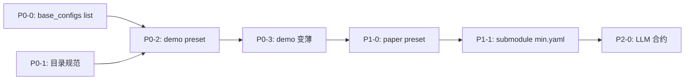

# Review: decouple-uxfd-operator-configs

**Review 日期**: 2026-01-19
**Review 对象**: `1_19/web/复现/` 目录下的文档

---

## 📁 文件概览

| 文件 | 类型 | 评分 | 说明 |
|------|------|------|------|
| `g.md` | 架构review | ✅ 优秀 | 准确识别工程误区，强调配置继承机制 |
| `gpt.md` | README | ✅ 清晰 | 简洁说明目标+落盘文件 |
| `plan_decouple_operator_configs.md` | 设计方案 | ⚠️ 需澄清 | 设计合理但缺少实现细节 |
| `TODO_decouple_operator_configs.md` | 任务清单 | ✅ 可执行 | P0/P1/P2 分层清晰，DoD 明确 |

---

## 🟢 优点

### 1. g.md 对 `_base_` 的纠正准确

- 明确指出本仓库使用 `base_configs` 而非 `_base_` 继承
- 强调了配置机制的差异
- 指出 TON → DEN → TIFN 的串行演进路径

### 2. Plan 设计目标清晰

- 目标明确：主 config 只负责选择 preset
- In/Out 范围界定合理
- 不引入新的 YAML 继承语法

### 3. TODO 分层合理

- P0（机制）/ P1（paper对齐）/ P2（LLM自动化）
- 每个任务都有 DoD
- Evidence/Commands 清晰

---

## 🟡 需要澄清的问题

### 问题 1: `base_configs` 当前机制确认

**问题**: Plan 中提到"扩展 `base_configs` 支持 list[str]"，但需要确认：
- 当前 `base_configs` 是否已支持 list？如果是，扩展范围是什么？
- `ConfigWrapper.update()` 的递归合并行为是否已验证？

**建议**: 在 Plan 中添加：
```markdown
## Current Behavior (已验证)
- `base_configs.model` 当前仅支持单个 string
- `ConfigWrapper.update()` 已支持递归 merge（见 src/configs/config_utils.py:XXX）
```

---

### 问题 2: Preset 文件命名约定

**问题**: TODO 中提到 `<paper_id>.yaml`，但 paper_id 格式未定义：
- `1D-2D_fusion_explainable` → 是否转为 `1d_2d_fusion.yaml`？
- 是否需要版本号（如 `v1`）？

**建议**: 在 P0-1 中明确命名规范：
```markdown
命名规范：
- demo preset: `uxfd_demo_<variant>.yaml` (min/sp2d/full)
- paper preset: `<paper_id>.yaml`（使用 submodule 目录名，保持原样）
```

---

### 问题 3: 与现有 `configs/base/` 的关系

**问题**: Plan 提出新建 `configs/presets/uxfd/operators/`，但：
- 这是与 `configs/base/` 平行的新目录？
- 还是 `configs/base/` 的子目录？
- 与 `configs/demo/` 的关系是什么？

**建议**: 在 Plan 中添加目录结构图：
```markdown
configs/
├── base/           # 现有：基础模型定义
│   └── model/
├── presets/        # 新增：算子预设
│   └── uxfd/
│       └── operators/
├── demo/           # 现有：demo 实验（会变薄）
│   └── uxfd/
└── experiments/    # 用户实验
```

---

## 🔴 潜在风险

### 风险 1: Preset 叠加顺序语义未明确定义

**问题**: Plan 说"后面的 fragment 覆盖前面的同名字段"，但：
- 这是 Python dict merge 的天然行为，还是需要专门保证？
- 如果用户错误地写反了顺序，是否有保护？

**建议**: 在 P0-0 中添加测试用例验证顺序行为：
```python
def test_preset_override_order():
    """验证 preset 叠加顺序：后覆盖前"""
    cfg = load_config("""
    base_configs:
      model:
        - "preset_a.yaml"  # uxfd.enable_sp2d: true
        - "preset_b.yaml"  # uxfd.enable_sp2d: false
    """)
    assert cfg.model.uxfd.enable_sp2d == False
```

---

### 风险 2: Submodule 提交依赖人工操作

**问题**: P1-1 需要"submodule 内提交"，但：
- 是否已有自动化脚本？
- 如果 submodule 未初始化怎么办？

**建议**: 在 TODO 中添加检查步骤：
```markdown
- [ ] P1-1 前置检查：验证 submodule 状态
  - 命令：`git submodule status | grep paper/UXFD_paper`
  - 预期：7 个 submodule 已初始化且非 dirty
```

---

## 📋 建议补充的内容

### Plan 文件补充

#### 1. 实现细节章节
```markdown
## Implementation Details

### P0-0: 扩展 base_configs 支持 list
- 文件：`src/configs/config_utils.py`
- 修改：`load_config()` 中处理 `base_configs` 的逻辑
- 伪代码：
  ```python
  for block, bases in config.get("base_configs", {}).items():
      if isinstance(bases, str):  # 兼容旧格式
          bases = [bases]
      for base_path in bases:
          base_cfg = load_yaml(base_path)
          merged = deep_merge(merged, base_cfg)
  ```

### P0-1: Preset 格式规范
- 文件：`configs/presets/uxfd/operators/README.md`
- 内容：格式说明、命名约定、示例
```

#### 2. 回滚计划
```markdown
## Rollback
- 如果 `base_configs` list 改造导致旧 YAML 失效：
  - 回滚点：保留 `load_config_legacy()` 分支
  - 验证：`python -m scripts.validate_configs` 必须通过
```

---

### TODO 文件补充

#### 1. 预计工时表
```markdown
| 任务 | 预计工时 | 风险 |
|------|----------|------|
| P0-0 | 2-3h | 中：涉及配置加载器核心逻辑 |
| P0-1 | 0.5h | 低：只需创建目录和 README |
| P0-2 | 1-2h | 低：纯 YAML 编写 |
| P0-3 | 1-2h | 中：需要验证 demo 可跑通 |
```

#### 2. 依赖关系图


---

## ✅ 总体评价

| 维度 | 评分 | 说明 |
|------|------|------|
| 技术准确性 | ✅ | 与 `base_configs` 机制对齐 |
| 架构合理性 | ✅ | 解耦目标清晰，不影响模型代码 |
| 可执行性 | ⚠️ | TODO 清晰但 Plan 缺少实现细节 |
| 风险控制 | ⚠️ | 缺少 rollback 计划和顺序验证 |
| 文档完整性 | ✅ | g.md / gpt.md 作为补充说明良好 |

---

## 建议优先级

| 优先级 | 建议项 | 影响文件 |
|--------|--------|----------|
| P0 | 在 Plan 中补充实现细节和回滚计划 | plan_decouple_operator_configs.md |
| P1 | 在 TODO 中添加预计工时和依赖图 | TODO_decouple_operator_configs.md |
| P2 | 添加 `base_configs` 当前行为的验证命令 | plan_decouple_operator_configs.md |

---

## 结论

**整体方案可行**，架构设计合理，与现有 `base_configs` 机制对齐。

**建议在执行前**：
1. 验证 `base_configs` 当前行为（是否已支持 list）
2. 明确 preset 命名规范和目录结构
3. 添加顺序验证测试用例
4. 准备回滚计划
